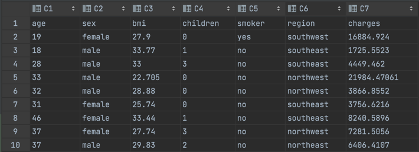

# Домашнее задание 3

### Реализация
В качестве трейта параметров модели использую расширенный `PredictorParams`, добавил в него `useBatch` для включения матричной арифметики.  
Веса инициализирую числом `1/{число фичей}`, чтобы избежать резкого возрастания градиента на первом шаге.  
Останавливаю градиентный спуск, если ошибка стала меньше `eps = 1e-7` или прошло `maxIterations = 10000` итераций.  
При пересчете градиента, домножаю формулу на `lambda`, чтобы с одной стороны, изменение градиента не зависело от числа строк датасета, а с другой стороны, чтобы градиент не возрастал при больших значениях в `labelCol`.  
Применяю трюк имени Дмитрия Бугайченко с выносом ` if (isUseBatch)` вне исполняемый спарком лямбды.  
Из неожиданного, использую `Vector`, а не `Double` в качестве `labelCol`, потому что за достаточно быстрое время не научился доставать значения из `Dataset[Double]`, зато с `Dataset[Vector]` все работает прекрасно.

### Тестирование
В коде представлено 8 тестов, первые три из них из семейства easy sample. Они запускаются на маленьком датасете, задающим прямую y = x, без шума. Суть этих тестов быстро проверить алгоритм на адекватность:
* Estimator should calculate weights, easy sample: запуск `fit` на простом датасете, проверка, что вес единственного предиктора равен `1`
* Estimator should calculate weights, batch mode, easy sample: аналогично, но в режиме матричной арифметики
* Model should predict value, easy sample: проверка метода `transform` на простом датасете

Следующие 3 теста аналогичные, но запускаются на датасете из 100000 элементов, скрытые параметры модели (1.5, 0.3, -0.7), уровень шума 1e-7, требуемая точность от модели +- 1e-5.  
Оставшиеся 2 теста проверяют, что модель успешно работает после перечитывания своих параметров. 

### Запуск на реальных данных
Изначальный датасет выглядит следующим образом.  
  
Предобработка данных по колонкам датасета:
* `age`: без изменений 
* `sex`: one-hot encoding, то есть колонка разделена на две вида `isMale`, `isFemale`
* `bmi`: без изменений
* `children`: без изменений
* `smoker`: one-hot encoding, то есть колонка разделена на две вида `isSmoker`, `isNotSmoker`
* `region`: one-hot encoding, то есть колонка разделена на 4 вида `isSouthwest`, `isSoutheast`, `isNorthwest`, `isNortheast`
* `charges`: без изменений

Неопробованные идеи: 
* Прогнать `age`, `bim` через `StandartScaler`
* Предсказывать `log(charges)`, чтобы уменьшить модуль градиента и улучшить сходимость
* Дополнительно выделить из age фичи `isYoung`, `isMidAged`, `isOld`
* Сделать почти one-hot для `children` виде `isNoChildren`, `isOneChild`, `isTwoChildren`, `isThreeOrMoreChildren`

В качестве метрик качества были выбраны R^2, Mean Squared Error, Mean Absolute Error. По результатам запуска с 10000 итераций градиентного спуска получены результаты:
* `R^2 = 0.7373740707191444`
* `MSE = 3.282862503472617E7`
* `MAE = 4101.749887609`

Обучаюсь на 80% данных, метрики считаю на оставшихся 20%.

Если сравнивать с решением, приведенным ка kaggle, то у него R^2 имеет значение 0.7795687545055299, то есть незначительно отличается от полученного мною результата.  
Таким образом, делаю вывод, что реализованная мною модель отлично справляется задачей регрессии на данном датасете. Более того, увеличив число итераций и проверив все свои гипотезы, думаю, вполне смогу догнать решение с kaggle.  
Также хочу отметить, что для данного датасета считаю более подходящим использование бустинга, потому что большая часть фичей в датасете "ветвится", например, в зависимости от региона цена медицинских услуг может существенно отличаться: в случае линейной регрессии отличие входит в скор аддитивно (`+= w_region * x_region`), а в случае бустинга влияние на скор может быть более гибким за счет ветвления дерева (`+= w_region_bmi * x_bmi`, то есть тут `w_bmi` зависит от региона). 